# oficina-os-service

Microsserviço responsável por Pessoa, Usuário, Cliente, Veículo, Ordem de Serviço, histórico de estados e orquestração da Saga da plataforma de oficina.

Este repositório segue a governança definida em [../oficina-platform](../oficina-platform/). Para tarefas automatizadas, leia também [AGENTS.md](AGENTS.md) e [TODO.md](TODO.md).

## Responsabilidades

- manter cadastros operacionais de Pessoa, Usuário, Cliente e Veículo;
- expor o CRUD de usuários operacionais somente para o papel `administrativo`, com estados `ATIVO`, `INATIVO` e `BLOQUEADO`;
- abrir, consultar, atualizar estado, cancelar, finalizar e entregar Ordens de Serviço;
- manter snapshots de itens de peça e serviço vinculados à OS;
- registrar histórico de estados da OS;
- orquestrar a Saga da Ordem de Serviço;
- produzir e consumir eventos de domínio ligados à OS e à Saga.

O serviço não é dono de catálogo técnico, estoque, orçamento ou pagamento.

Credenciais, login e emissão de JWT também não pertencem a este serviço. Essas responsabilidades permanecem no `oficina-auth-lambda`; o OS mantém apenas Pessoa, status e papéis operacionais.

## Saga orquestrada

A plataforma usa **Saga orquestrada** pelo `oficina-os-service`, conforme a [ADR-009 - Estratégia de Saga Pattern](../oficina-platform/adr/ADR-009%20-%20Estratégia%20de%20Saga%20Pattern.md), os [Fluxos da Saga da Ordem de Serviço](../oficina-platform/docs/architecture/saga-flows.md) e o [Contrato de Saga do oficina-os-service](../oficina-platform/contracts/saga/oficina-os-saga-v1.md).

O `oficina-os-service` é o orquestrador porque mantém o ciclo de vida global da Ordem de Serviço, registra histórico de estados e centraliza a decisão de avançar, aguardar, compensar ou bloquear o fluxo distribuído. Essa escolha deixa a sequência de negócio explícita, facilita observabilidade e evita que regras de compensação fiquem dispersas entre `oficina-billing-service` e `oficina-execution-service`.

Os serviços participantes preservam seus próprios bancos e regras de domínio. Este serviço coordena comandos idempotentes e consome eventos de Billing e Execution para atualizar a Saga, publicar `sagaFinalizadaComSucesso` ou executar compensações que resultem em `sagaCompensada`.

A orquestração expõe em `/q/metrics` os contadores `saga.instances.started.count`, `saga.instances.completed.count`, `saga.instances.compensated.count` e `saga.instances.failed.count`, além do histograma `saga.step.duration`. As dimensões ficam limitadas a `service`, `sagaType`, `step` e `reason` categórico. Logs e spans de transição recebem `sagaId`, `sagaStep`, estado da Saga, `ordemServicoId` e `correlationId`, sem usar identificadores como tags de métricas.

## Stack

- Java 25
- Quarkus 3.37.0
- PostgreSQL no database `oficina_os`
- Flyway para migrations
- JWT, OpenAPI, Health, métricas Prometheus, logs JSON e OpenTelemetry

## Arquitetura

O serviço segue Clean Architecture com `core/entities`, portas em `core/interfaces`, casos de uso em `core/usecases`, entrada REST em `interfaces/controllers` e adapters em `framework/`. O `core/` não deve importar CDI, JAX-RS, Quarkus, JDBC ou classes de `framework/` e `interfaces/`.

Os casos de uso são classes Java puras instanciadas por [AtendimentoConfiguration](src/main/java/br/com/oficina/os/framework/web/AtendimentoConfiguration.java) e [UsuariosConfiguration](src/main/java/br/com/oficina/os/framework/web/UsuariosConfiguration.java). Resources e presenters chamam casos de uso e tipos do core; persistência e mensageria ficam atrás das portas [AtendimentoGateway](src/main/java/br/com/oficina/os/core/interfaces/gateway/AtendimentoGateway.java) e [UsuarioGateway](src/main/java/br/com/oficina/os/core/interfaces/gateway/UsuarioGateway.java). A regra é validada por [CleanArchitectureBoundaryTest](src/test/java/br/com/oficina/os/architecture/CleanArchitectureBoundaryTest.java).

```mermaid
flowchart LR
  HTTP["API REST<br/>clientes, veículos, usuários e OS"] --> Web["framework/web<br/>Resources e composição CDI"]
  Web --> Controllers["interfaces/controllers<br/>adaptação de entrada"]
  Controllers --> UseCases["core/usecases<br/>regras e orquestração"]
  UseCases --> Domain["core/entities<br/>Cliente, Veículo, OS e Saga"]
  UseCases --> Ports["core/interfaces<br/>portas de saída"]
  Presenters["interfaces/presenters<br/>view models"] --> HTTP
  Controllers --> Presenters

  Ports --> JDBC["framework/db<br/>adapters JDBC"]
  JDBC --> Postgres[("PostgreSQL oficina_os<br/>agregados, histórico, Inbox,<br/>Outbox e idempotência")]
  Ports --> Messaging["framework/messaging<br/>Outbox publisher e consumers"]
  Messaging --> SNS["SNS<br/>eventos de OS e Saga"]
  InboundSNS["SNS<br/>eventos de Billing e Execution"] --> SQS["SQS do oficina-os-service"]
  SQS --> Messaging

  UseCases --> Saga["Saga orquestrada<br/>avançar, aguardar ou compensar"]
  Saga --> Messaging
  Billing["oficina-billing-service"] --> InboundSNS
  Execution["oficina-execution-service"] --> InboundSNS
  SNS --> Billing
  SNS --> Execution

  classDef core fill:#e5f5ec,stroke:#176b45,color:#14202b;
  classDef adapter fill:#e7f1fa,stroke:#1f5f99,color:#14202b;
  classDef external fill:#fff3d6,stroke:#7a4b00,color:#14202b;
  class Domain,UseCases,Ports,Saga core;
  class Web,Controllers,Presenters,JDBC,Messaging adapter;
  class HTTP,Postgres,SNS,InboundSNS,SQS,Billing,Execution external;
```



O serviço possui ownership de Cliente, Veículo, Ordem de Serviço e da Saga, mas não de catálogo, estoque ou finanças. A sequência e as compensações completas estão em [Fluxos da Saga](../oficina-platform/docs/architecture/saga-flows.md).

## Setup local

Pré-requisitos:

- Java 25;
- Docker, para build de imagem e dependências locais;
- acesso ao repositório `../oficina-platform`, usado pelos testes de contrato;
- acesso opcional ao repositório `../oficina-infra`, usado para subir dependências compartilhadas da suíte.

Ferramentas locais recomendadas para validação de CI/CD, Dockerfile e scripts estão em [Ferramentas de validação local](../oficina-platform/docs/delivery/validation-tooling.md).

Dependências locais compartilhadas podem ser iniciadas pelo `oficina-infra`:

```bash
cd ../oficina-infra
docker compose -f compose.local.yml up -d postgres dynamodb localstack
scripts/local/bootstrap-local.sh
```

Volte para este repositório antes de executar o serviço:

```bash
cd ../oficina-os-service
```

## Execução local

```bash
./mvnw quarkus:dev -Ppostgresql
./mvnw test -Ppostgresql
./mvnw -B verify -Ppostgresql -DskipITs=false -DfailIfNoTests=false
./mvnw -B package -Ppostgresql
```

O comando `verify` executa testes unitários, integração, contrato, BDD e verificação de cobertura JaCoCo.

Para uma execução local deliberada sem PostgreSQL, use exclusivamente o profile Quarkus `dev` e desative os componentes de banco que não serão usados:

```bash
./mvnw quarkus:dev -Ppostgresql \
  -Doficina.persistence.kind=memory \
  -Dquarkus.datasource.active=false \
  -Dquarkus.flyway.active=false
```

Esse modo mantém dados apenas durante o processo e não deve ser usado em imagem, release ou deploy.

## Persistência

Em runtime, a persistência padrão é PostgreSQL (`oficina.persistence.kind=postgresql`) no database `oficina_os`, com migrations Flyway. Pessoa, Usuário, papéis, Cliente, Veículo, Ordem de Serviço, histórico de estados, Saga, Inbox e Outbox usam adapters JDBC e devem sobreviver a restart do processo ou pod quando conectados ao banco do ambiente.

A migration `V5__remove_usuario_password_hash.sql` remove a coluna histórica `usuario.password_hash`. O database `oficina_os` não armazena credenciais; o store do `oficina-auth-lambda` recebe somente a projeção operacional pelos eventos de usuário.

O modo em memória permanece apenas para testes rápidos (`%test.oficina.persistence.kind=memory`), execução local deliberada com profile `dev` e fixtures explícitas. Os seletores dos adapters aceitam somente `postgresql` ou `memory`; valores desconhecidos interrompem a inicialização. A validação com PostgreSQL real fica coberta por [PostgresAtendimentoSeedStoreTest](src/test/java/br/com/oficina/os/framework/db/PostgresAtendimentoSeedStoreTest.java), que sobe PostgreSQL via Testcontainers, aplica as migrations do serviço e exercita o CRUD persistente de usuários.

## Usuários operacionais

As rotas abaixo exigem JWT com o papel `administrativo`:

- `POST /api/v1/usuarios`: cria Pessoa e Usuário; requer `X-Idempotency-Key`;
- `GET /api/v1/usuarios`: lista usuários com paginação e filtros remotos por nome, CPF, status e papel;
- `GET /api/v1/usuarios/{usuarioId}`: consulta o agregado;
- `PUT /api/v1/usuarios/{usuarioId}`: substitui nome, CPF e papéis, preservando o estado atual;
- `POST /api/v1/usuarios/{usuarioId}/bloqueio`: bloqueia explicitamente e de forma idempotente;
- `POST /api/v1/usuarios/{usuarioId}/reativacao`: reativa explicitamente e de forma idempotente;
- `DELETE /api/v1/usuarios/{usuarioId}`: realiza exclusão lógica, alterando o status para `INATIVO`.

O payload não aceita senha. Cada usuário retorna `acoesPermitidas`, calculadas pelo backend a partir do estado canônico. Os papéis são `administrativo`, `mecanico` e `recepcionista`; o documento operacional deve conter 11 dígitos. Criação, atualização e mudanças de estado persistem o snapshot correspondente na Outbox. Publisher e consumidores usam executores independentes, impedindo que o long polling das filas atrase a publicação. Os eventos não carregam credenciais e alimentam o `oficina-auth-sync-lambda`. O contrato completo está no [Contrato de APIs REST](../oficina-platform/contracts/Contrato%20de%20APIs%20REST.md), no [Contrato de Eventos de Domínio](../oficina-platform/contracts/Contrato%20de%20Eventos%20de%20Dom%C3%ADnio.md) e no [OpenAPI do oficina-os-service](../oficina-platform/contracts/openapi/oficina-os-service.yaml).

## Fail-fast de runtime

O runtime é protegido quando o profile Quarkus ativo contém `prod` ou `lab`, ou quando `DEPLOYMENT_ENVIRONMENT=lab`. Nesses casos, [RuntimeStartupValidator](src/main/java/br/com/oficina/os/framework/web/RuntimeStartupValidator.java) interrompe o startup se houver fallback para memória, mensageria desabilitada, endpoint AWS local, audience divergente ou configuração obrigatória ausente.

Configurações obrigatórias em `prod`/`lab`:

- `DB_USERNAME`, `DB_PASSWORD`, `JDBC_DATABASE_URL` e `REACTIVE_DATABASE_URL`;
- `AWS_REGION`;
- `OFICINA_AUTH_ISSUER`, `OFICINA_AUTH_AUDIENCE=oficina-os-service` e `MP_JWT_VERIFY_PUBLICKEY_LOCATION`;
- `OFICINA_MESSAGING_ENABLED=true`, com publisher, consumer e worker também habilitados.

No startup protegido, o serviço abre e valida uma conexão PostgreSQL, consulta os atributos de todos os tópicos SNS produzidos e resolve todas as filas SQS consumidas. A identidade AWS pode vir da cadeia padrão ou de IRSA. Credenciais explícitas continuam opcionais: `AWS_ACCESS_KEY_ID` e `AWS_SECRET_ACCESS_KEY` devem ser informadas juntas; quando `AWS_SESSION_TOKEN` também estiver presente, o serviço usa credenciais temporárias e rejeita qualquer trio incompleto. A policy de runtime precisa permitir `sns:GetTopicAttributes` nos tópicos produzidos, além de `sns:Publish` e das ações SQS já exigidas pelo consumo.

## Mensageria SNS/SQS

O serviço publica eventos de OS e Saga exclusivamente pela Outbox local. Quando `OFICINA_MESSAGING_ENABLED=true`, o worker assíncrono publica pendentes no SNS canônico, aplica retry/backoff, marca `PUBLISHED` após sucesso e marca `FAILED` ao esgotar tentativas. O consumo usa filas SQS por tópico/consumidor e só remove a mensagem depois do processamento persistido na Saga local.

Configuração principal:

- `OFICINA_MESSAGING_ENABLED`
- `OFICINA_MESSAGING_ENDPOINT_OVERRIDE`, para LocalStack
- `OFICINA_MESSAGING_PUBLISHER_BATCH_SIZE`
- `OFICINA_MESSAGING_PUBLISHER_MAX_ATTEMPTS`
- `OFICINA_MESSAGING_CONSUMER_MAX_MESSAGES`
- `OFICINA_MESSAGING_CONSUMER_WAIT_TIME_SECONDS`

Os nomes físicos de tópicos e filas seguem o padrão do `oficina-infra`: pontos do tópico canônico são trocados por hífen, e filas consumidoras usam `<topico>.<servico-consumidor>`. A validação local de publicação e consumo SNS/SQS fica em [SnsSqsMessagingIntegrationTest](src/test/java/br/com/oficina/os/framework/messaging/SnsSqsMessagingIntegrationTest.java), com LocalStack via Testcontainers.

## Testes e BDD

Os cenários BDD da Saga estão em [src/test/resources/features/saga_ordem_servico.feature](src/test/resources/features/saga_ordem_servico.feature), com steps em [src/test/java/br/com/oficina/os/bdd/SagaOrdemServicoSteps.java](src/test/java/br/com/oficina/os/bdd/SagaOrdemServicoSteps.java). Eles validam o fluxo feliz da OS por eventos consumidos de `oficina-execution-service` e `oficina-billing-service`, encerrando a Saga com `sagaFinalizadaComSucesso`, e um fluxo de falha operacional antes da finalização, encerrando a Saga com `sagaCompensada`.

O runner Cucumber participa do ciclo Maven padrão. Assim, o comando usado pelo [Template GitHub Actions para Microsserviços](../oficina-platform/templates/github-actions/README.md) executa o BDD junto com os demais testes:

```bash
./mvnw -B verify -P"${MAVEN_PROFILE}" -DskipITs=false -DfailIfNoTests=false
```

Evidência local de execução compatível com CI em 2026-07-12:

```text
./mvnw -B clean verify -Ppostgresql -DskipITs=false -DfailIfNoTests=false
2 scenarios (2 passed)
15 steps (15 passed)
Tests run: 173, Failures: 0, Errors: 0, Skipped: 0
All coverage checks have been met.
BUILD SUCCESS
```

## Cobertura

O JaCoCo é executado no `verify`, gera relatório em `target/jacoco-report/` e falha o build quando a cobertura de instruções do bundle fica abaixo de 90%. O [Template GitHub Actions para Microsserviços](../oficina-platform/templates/github-actions/README.md) publica esse diretório como artifact `jacoco-report-oficina-os-service` e envia `target/jacoco-report/jacoco.xml` ao SonarCloud.

Evidência local de cobertura em 2026-07-12:

```text
instruction=94.77% branch=76.88% line=94.19% complexity=83.30%
```

## CI/CD

Os workflows ficam em [.github/workflows/service-ci.yml](.github/workflows/service-ci.yml) e [.github/workflows/open-pr-to-main.yml](.github/workflows/open-pr-to-main.yml), derivados do [Template GitHub Actions para Microsserviços](../oficina-platform/templates/github-actions/README.md).

Pull requests e pushes na `main` executam o check `service-ci-validate` com `./mvnw -B verify -Ppostgresql -DskipITs=false -DfailIfNoTests=false`, validam a cobertura mínima de 90%, publicam o artifact `jacoco-report-oficina-os-service` e executam SonarCloud com o relatório `target/jacoco-report/jacoco.xml`. O secret `SONAR_TOKEN` deve existir no repositório ou na organização GitHub, e a Automatic Analysis do SonarCloud deve ficar desabilitada para evitar análise duplicada sem cobertura.

A publicação de imagem e o deploy Kubernetes são automáticos por padrão em `main` e podem ser desligados explicitamente:

- `ENABLE_IMAGE_PUBLISH=false` desabilita consulta ao ECR, build/push da imagem Docker e release com metadados da imagem;
- `ENABLE_K8S_DEPLOY=false` desabilita materialização ou atualização do Deployment no EKS e validação do rollout;
- com as variáveis ausentes, o workflow publica imagem/release quando necessário e aplica o Deployment no EKS;
- em `workflow_dispatch`, os inputs `publish_image` e `deploy` permitem forçar esses estágios mesmo quando as variáveis foram desabilitadas.

O workflow não usa GitHub Environment para evitar aprovação manual nos jobs. As variáveis e secrets de AWS/ECR/EKS devem estar em nível de repositório ou organização, e o controle manual do fluxo acontece no merge do PR aberto automaticamente a partir da branch `develop`.

Quando `ENABLE_K8S_DEPLOY` não é `false`, o workflow valida e aplica a base canônica em `k8s/base/`, usando o `oficina-infra` para compor os valores e secrets do ambiente `lab`, aguarda o rollout no EKS e confere a imagem final. Após recriar a infraestrutura base do lab, não é necessário executar um segundo `Deploy Lab` apenas para materializar este serviço.

## Validação de contratos

O teste [PlatformContractsTest](src/test/java/br/com/oficina/os/contracts/PlatformContractsTest.java) valida o serviço contra os contratos canônicos em `../oficina-platform/contracts`: OpenAPI, schemas JSON de eventos, [Contrato de Erros REST](../oficina-platform/contracts/error-model.md), [Contrato de Idempotência](../oficina-platform/contracts/idempotency.md) e [Contrato de Saga do oficina-os-service](../oficina-platform/contracts/saga/oficina-os-saga-v1.md).

## Docker

```bash
docker build --build-arg MAVEN_PROFILE=postgresql -t oficina-os-service:local .
docker run --rm -p 8080:8080 \
  -e QUARKUS_PROFILE=dev \
  -e OFICINA_PERSISTENCE_KIND=memory \
  -e QUARKUS_DATASOURCE_ACTIVE=false \
  -e QUARKUS_FLYWAY_ACTIVE=false \
  -e MP_JWT_VERIFY_PUBLICKEY_LOCATION=classpath:jwt/publicKey.pem \
  oficina-os-service:local
```

## Kubernetes

A estratégia de entrega dos manifests está definida em [Estratégia de entrega dos manifestos Kubernetes](../oficina-platform/docs/infrastructure/kubernetes-manifest-strategy.md).

Este repositório é a fonte canônica do Dockerfile e da base Kubernetes executável em [`k8s/base/`](k8s/base/). O `oficina-infra` mantém a composição, os secrets e os componentes compartilhados do ambiente `lab`; o template normativo permanece em [Template Kubernetes do oficina-os-service](../oficina-platform/templates/kubernetes/base/oficina-os-service/).

O deploy automatizado com `ENABLE_K8S_DEPLOY` diferente de `false` materializa o Deployment quando ele ainda não existe, atualiza a imagem quando ele já existe e valida o rollout no EKS usando o script canônico `scripts/manual/apply-microservices.sh` do `oficina-infra`.

## Endpoint técnico

- `GET /api/v1/status`: expõe identidade do serviço, ambiente e status técnico básico.

Health checks do Quarkus ficam em `/q/health`, `/q/health/live` e `/q/health/ready`.

## Swagger/OpenAPI

O contrato canônico do serviço é a [OpenAPI do oficina-os-service](../oficina-platform/contracts/openapi/oficina-os-service.yaml), mantida no repositório de plataforma.

Com o serviço em execução local na porta `8080`, a documentação gerada pelo Quarkus fica disponível em:

- Swagger UI: `http://localhost:8080/q/swagger-ui/`;
- OpenAPI YAML: `http://localhost:8080/q/openapi`;
- OpenAPI JSON: `http://localhost:8080/q/openapi?format=json`.

O teste [PlatformContractsTest](src/test/java/br/com/oficina/os/contracts/PlatformContractsTest.java) valida que a OpenAPI gerada em runtime mantém os caminhos e métodos definidos no contrato canônico.

## Contratos

- [Contrato de APIs REST](../oficina-platform/contracts/Contrato%20de%20APIs%20REST.md)
- [OpenAPI do oficina-os-service](../oficina-platform/contracts/openapi/oficina-os-service.yaml)
- [Contrato de Eventos de Domínio](../oficina-platform/contracts/Contrato%20de%20Eventos%20de%20Domínio.md)
- [Contrato de Estados da Ordem de Serviço](../oficina-platform/contracts/Contrato%20de%20Estados%20da%20Ordem%20de%20Serviço.md)
- [Contrato de Erros REST](../oficina-platform/contracts/error-model.md)
- [Contrato de Idempotência](../oficina-platform/contracts/idempotency.md)
- [Contrato de Saga do oficina-os-service](../oficina-platform/contracts/saga/oficina-os-saga-v1.md)

## Variáveis principais

- `DB_USERNAME`
- `DB_PASSWORD`
- `JDBC_DATABASE_URL`
- `REACTIVE_DATABASE_URL`
- `OFICINA_PERSISTENCE_KIND` (`postgresql` em runtime; `memory` apenas em testes/fixtures explícitas)
- `OFICINA_AUTH_ISSUER`
- `OFICINA_AUTH_AUDIENCE`
- `MP_JWT_VERIFY_PUBLICKEY_LOCATION`
- `OTEL_EXPORTER_OTLP_ENDPOINT`
- `DEPLOYMENT_ENVIRONMENT`

Em ambiente local, valores de desenvolvimento ficam em `src/main/resources/application.properties`. Em Kubernetes, variáveis de banco vêm do secret `oficina-os-service-database-env`, e variáveis não sensíveis vêm do ConfigMap canônico em [`k8s/base/configmap.yaml`](k8s/base/configmap.yaml).

## Estrutura

```text
src/main/java/br/com/oficina/os/
  core/
  interfaces/
  framework/
src/main/resources/
  db/migration/
```

## Próximo Trabalho

O [TODO.md](TODO.md) é o checklist histórico das entregas concluídas. Novos incrementos, inclusive evidências remotas, são controlados no [ROADMAP da plataforma](../oficina-platform/ROADMAP.md).
